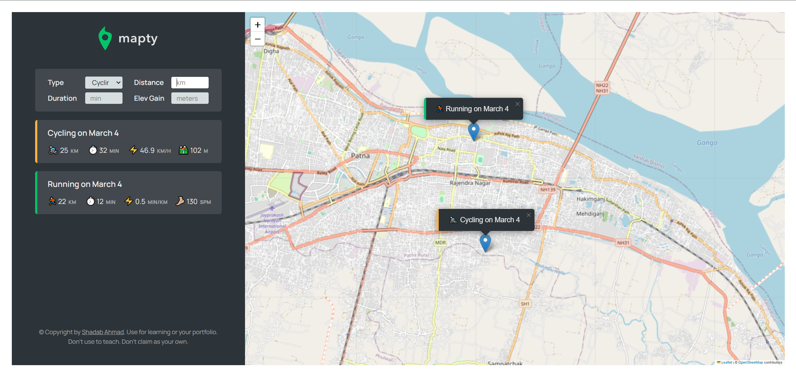

# Mapty App

## Overview
The Mapty app is a user-friendly web application designed for outdoor enthusiasts to log their cycling and running workouts. It automatically detects your current location using your IP address and allows you to mark any location on the map to log a workout. Users can specify the type of workout (cycling or running) and the distance covered.

## Features
- **Location Detection**: Automatically detects your current location using your IP address.
- **Interactive Workout Logging**: Users can click anywhere on the map to mark the start of their workout. A detailed sidebar popup allows for the comprehensive logging of workout details.
- **Enhanced Workout Options**: Beyond simply categorizing activities as cycling or running, users can input distance (in km), duration (in minutes), elevation gain (in meters), and cadence (for running), making for a detailed workout log.
- **Distance and Duration Tracking**: Allows for precise input of the distance covered (in km) and the duration of the workout (in minutes).
- **Elevation Gain Tracking**: Records the elevation gain (in meters) during the workout, providing valuable insights into terrain challenges.
- **Cadence Tracking**: For running workouts, users can record their cadence (steps/min), adding another layer of detail to their workout logs.

## How to Use
1. **Open the App:** Launch the Mapty app. It will automatically detect and display your current location on the map.
2. **Mark Your Activity:** Click on the desired location on the map where you wish to start your workout. This action places a marker on the map.
3. **Log Your Workout Details**: In the sidebar popup, fill in the workout type (cycling or running), distance (in km), duration (in minutes), elevation gain (in meters), and cadence (for running), as applicable.
4. **Review and Edit:** You can view all your logged activities on the map. Click on any marker to see the details or to edit them.

## Setup
To set up the app on your local machine:
1. Clone the repository: `git clone https://github.com/ahmad2shadab/Mapty-App.git`
2. Open `index.html` in your browser to start using the app.

## Technologies Used
- HTML
- CSS
- JavaScript
- Leaflet.js for map functionality

Try the Mapty App live [here](https://ahmad2shadab.github.io/Mapty-App/)

## Contributions
Contributions, issues, and feature requests are welcome! Feel free to check the issues page at `https://github.com/ahmad2shadab/mapty-app/issues`.

## Support
For query reach out at ahmad8shadab@gmail.com

## License
This project is licensed under the MIT License - see the [LICENSE](LICENSE) file for details.

